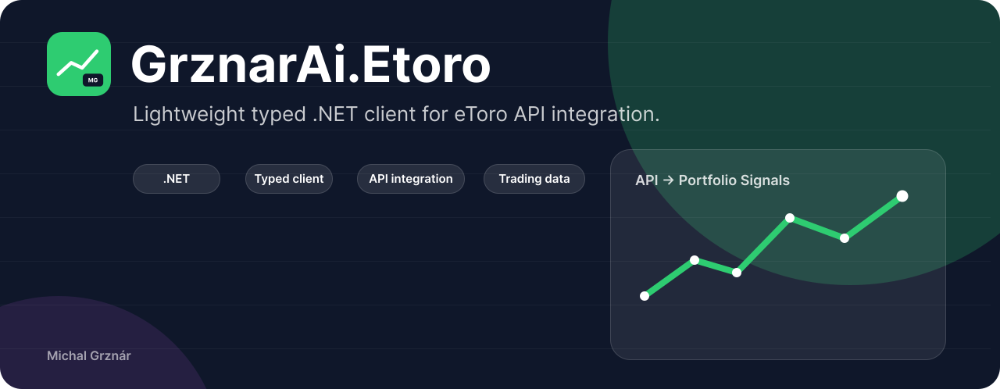

# GrznarAi Trading ReadOnly



Read-only typed .NET client for trading platform public APIs. Currently targets the eToro public API. This project is not affiliated with eToro.

NuGet package: `GrznarAi.Trading.ReadOnly`  
Target framework: `.NET 9`  
License: MIT

This library gives .NET applications a small, typed wrapper around eToro API calls, including authentication headers, `HttpClientFactory` integration, request validation, rate-limit handling, API exceptions, portfolio/trading data, market data, user/social data, watchlists, feed posts, and account calculation helpers.

## ⚠️ Disclaimer

This project is **not affiliated with, endorsed by, or connected to eToro in any way**.

This software is provided for **informational and educational purposes only**.

- It does **not provide financial advice**.
- It should **not be used as the sole basis for trading decisions**.
- Data retrieved may be **inaccurate, delayed, or incomplete**.
- Currently the library exposes **read-only** endpoints. Mutating endpoints
  (POST / PUT / DELETE — order placement, watchlist edits, etc.) will be added
  later; consumers using such operations do so at their own risk.

The author and contributors **disclaim all liability** for any direct,
indirect, incidental, consequential, or punitive damages arising from the use
of this software, including but not limited to financial loss, missed trades,
incorrect calculations, downtime, data loss, or breach of eToro's terms of
service. Use entirely at your own risk.

By using this library you acknowledge that you understand the risks of
algorithmic and API-driven trading and that you alone are responsible for
your trading decisions and compliance with applicable laws and eToro's API
terms of use.

## Installation

```powershell
dotnet add package GrznarAi.Trading.ReadOnly
```

## Quick Start

Configure credentials outside source control:

```powershell
dotnet user-secrets set "EToroOptions:ApiKey" "<api-key>"
dotnet user-secrets set "EToroOptions:UserKey" "<user-key>"
```

Register the client in `Program.cs`:

```csharp
using GrznarAi.Trading.ReadOnly.Client;

var builder = WebApplication.CreateBuilder(args);

builder.Services.AddEToro(builder.Configuration);

var app = builder.Build();
app.Run();
```

Use `IEToroClient` from DI:

```csharp
using GrznarAi.Trading.ReadOnly.Client;
using GrznarAi.Trading.ReadOnly.Models.Common;

app.MapGet("/portfolio", async (IEToroClient client, CancellationToken ct) =>
{
    var portfolio = await client.GetPortfolioAsync(EToroEnvironment.Real, ct);
    return Results.Ok(portfolio);
});
```

Use account calculations when you need derived metrics:

```csharp
using GrznarAi.Trading.ReadOnly.Models.Common;
using GrznarAi.Trading.ReadOnly.Services;

app.MapGet("/account-metrics", async (
    IEToroCalculationService calculations,
    CancellationToken ct) =>
{
    var metrics = await calculations.GetAccountMetricsAsync(EToroEnvironment.Real, ct);
    return Results.Ok(metrics);
});
```

## Configuration

Minimal `appsettings.json` (see also `appsettings.example.json`):

```json
{
  "EToroOptions": {
    "ApiKey": "replace-me-api-key",
    "UserKey": "replace-me-user-key",
    "Environment": "real",
    "BaseAddress": "https://public-api.etoro.com/api/v1/",
    "AllowCustomBaseAddress": false,
    "Timeout": "00:01:40",
    "UserAgent": "MyApp",
    "RateLimit": {
      "Enabled": true,
      "PermitLimit": 60,
      "Window": "00:01:00",
      "MaxRetries": 3,
      "RetryNonIdempotentRequests": false
    },
    "ErrorHandling": {
      "IncludeResponseBody": true,
      "RedactResponseBody": true,
      "MaxResponseBodyLength": 4096
    }
  }
}
```

Never commit real `ApiKey` or `UserKey` values. Use user secrets, environment variables, CI secrets, or your production secret store.

## Documentation

English:

- [Getting started](docs/en/getting-started.md)
- [Configuration](docs/en/configuration.md)
- [API reference](docs/en/api-reference.md)
- [Error handling](docs/en/error-handling.md)
- [Rate limiting and retries](docs/en/rate-limiting.md)
- [Account calculations](docs/en/account-calculations.md)
- [Testing and contributing](docs/en/testing-and-contributing.md)
- [CI/CD pipelines](docs/en/ci-cd.md)

Čeština:

- [Začínáme](docs/cs/getting-started.md)
- [Konfigurace](docs/cs/configuration.md)
- [API reference](docs/cs/api-reference.md)
- [Error handling](docs/cs/error-handling.md)
- [Rate limiting a retry](docs/cs/rate-limiting.md)
- [Výpočty účtu](docs/cs/account-calculations.md)
- [Testování a přispívání](docs/cs/testing-and-contributing.md)
- [CI/CD pipeliny](docs/cs/ci-cd.md)

## Current API Areas

- Trading: PnL, portfolio, closed trade history, orders, agent portfolios.
- Market data: exchanges, instrument types, instruments, search, rates, candles, closing prices, stock industries.
- User info: identity, profiles, user search, daily gain, gain history, live portfolio, trade info.
- Social: popular investors.
- Feed: instrument and user feed posts.
- Watchlists: own watchlists, default watchlist items, public watchlists, recommendations.
- Calculations: available cash, invested principal, unrealized PnL, realized PnL, equity, total return.

## Trim and NativeAOT

The library is designed to be trim and NativeAOT compatible for consumer applications. CI validates this with a small NativeAOT smoke-test app that registers the client through DI and treats trim/AOT warnings as build failures.

## Future Write Endpoints

Before POST, PUT, or DELETE endpoints are added to the public surface:

- Idempotency keys will be required per write request.
- `RetryNonIdempotentRequests` will stay `false` by default; write retries must be explicit.
- Write operations will use per-method rate limits, separate from read request limits.
- Calculation helpers will not place orders automatically from heuristics.
- A dedicated order client interface will stay separate from read interfaces.
- Write failures will use distinct exception types carrying broker-side error codes.
- Every write attempt will expose an audit-log hook with redacted payload data.

## Development

```powershell
dotnet restore
dotnet build
dotnet test
```

Integration tests require real eToro credentials and must keep secrets outside git.

## Contributing

Issues and pull requests are welcome. Keep changes focused, include tests for behavioral changes, and avoid committing credentials, generated build output, or local environment files.

## License

MIT License. Copyright (c) 2026 Michal Grznár.
